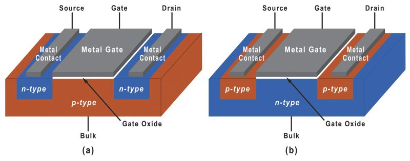
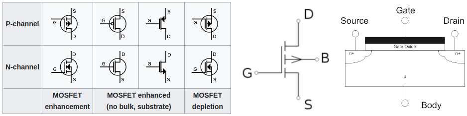

# Transistor Reference

## Schematics

<br>

<table width='100%'>
<tr>
<td valign='top'>
    
</td>
<td valign='top' width='40%'>
    <b>Open</b>: off, disconnected, no electrical contact.<br>
    <b>Closed</b>: on, connected, has electrical contact.<br><br>
    <table>
    <tr>
        <td>Type:</td><td>NMOS, MOSFET channel N</td>
    </tr>
    <tr>
        <td>Gate:</td><td>P-substrate</td>
    </tr>
    <tr>
        <td>Source:</td><td>N-substrate</td>
    </tr>
    <tr>
        <td>Drain:</td><td>N-substrate</td>
    </tr>
    </table>
    <table>
    <tr>
        <td>Type:</td><td>PMOS, MOSFET channel P</td>
    </tr>
    <tr>
        <td>Gate:</td><td>N-substrate</td>
    </tr>
    <tr>
        <td>Source:</td><td>P-substrate</td>
    </tr>
    <tr>
        <td>Drain:</td><td>P-substrate</td>
    </tr>
    </table>
</td>
</tr>
<tr>
    <td valign='top'>
        
    </td>
    <td valign='top'>
        Symbols:<br><br>
        
    </td>
</tr>
</table>




<details>
    <summary>CircuitJS code</summary>
    <br>
    <a href='https://www.falstad.com/circuit/circuitjs.html' target='_blank'>https://www.falstad.com/circuit/circuitjs.html</a>

```
$ 1 0.000005 2.3728258192205156 44 5 50 5e-11
f 304 240 352 240 0 1.5 0.02
172 256 240 224 240 0 7 5 5 0 0 0.5 Gate Voltage
w 352 256 352 304 3
w 352 224 352 128 3
172 352 128 352 96 0 7 5 5 0 0 0.5 Drain Voltage
g 352 304 352 320 0 0
s 272 240 304 240 0 1 false
f 528 240 576 240 1 1.5 0.02
s 496 240 528 240 0 0 false
172 480 240 448 240 0 7 5 5 0 0 0.5 Gate Voltage
w 576 128 576 224 3
w 352 128 576 128 0
w 576 256 576 304 3
w 576 304 352 304 0
x 359 224 369 227 4 15 D
x 306 256 317 259 4 15 G
x 360 258 370 261 4 15 S
x 584 225 594 228 4 15 S
x 584 260 594 263 4 15 D
x 533 254 544 257 4 15 G
x 134 207 321 210 4 15 NMOS,\sMOSFET\schannel\sN
x 603 205 788 208 4 15 PMOS,\sMOSFET\schannel\sP
x 337 346 370 349 4 15 GND
x 686 335 786 338 4 15 Current:\syellow
x 686 354 782 357 4 15 Voltage:\sgreen
w 480 240 496 240 3
w 256 240 272 240 3
o 0 64 0 4099 5 0.2 0 6 0 3 0 0 0 3 7 0 7 3
```

</details>

<br>

## Verilog MOSFET

- [nmos-signal](verilog/nmos-signal/)
- [nmos-supply](verilog/nmos-supply/)
- [pmos-signal](verilog/pmos-signal/)
- [pmos-supply](verilog/pmos-supply/)

<br>


<br>

```verilog
/*
 * NMOS and PMOS transistors.
 */

module mosfet_channel_n (
    input gate,
    input drain, 
    output source );

    // NMOS call:
    //   output  input  control
    nmos(source, drain, gate);

endmodule

module mosfet_channel_p (
    input gate,
    input source, 
    output drain );

    // PMOS call:
    //   output  input  control
    pmos(drain, source, gate);

endmodule
```

<br>

## Verilog CMOS inverter

- [cmos-inverter](verilog/cmos-inverter/)


<details>
    <summary>CircuitJS code</summary>
    <br>
    <a href='https://www.falstad.com/circuit/circuitjs.html' target='_blank'>https://www.falstad.com/circuit/circuitjs.html</a>

```
$ 1 0.000005 10.20027730826997 50 5 50 5e-11
f 208 176 272 176 1 1.5 0.02
f 208 304 272 304 0 1.5 0.02
w 272 208 352 208 0
w 208 176 208 240 0
w 208 240 208 304 0
M 352 208 416 208 0 2.5
R 272 112 272 80 0 0 40 5 0 0 0.5
g 272 240 304 240 0 0
s 176 240 208 240 0 0 false
w 272 112 144 112 0
w 144 240 176 240 0
w 272 144 272 160 0
w 272 336 352 336 0
w 352 336 352 208 0
w 272 272 272 288 0
x 230 194 241 197 4 15 G
x 228 319 239 322 4 15 G
x 280 165 290 168 4 15 S
x 280 199 290 202 4 15 D
x 279 291 289 294 4 15 D
x 280 325 290 328 4 15 S
w 144 240 144 112 0
w 272 144 272 112 0
x 199 143 240 146 4 14 PMOS
x 195 347 237 350 4 14 NMOS
w 272 320 272 336 0
w 272 240 272 272 0
w 272 192 272 208 0
```

</details>

<br>

## Links

[http://www.asic-world.com/verilog/](http://www.asic-world.com/verilog/)

[https://www.chipverify.com/verilog/](https://www.chipverify.com/verilog/)

[http://www.cs.nthu.edu.tw/~tcwang/4120-spring04/lec5.pdf](http://www.cs.nthu.edu.tw/~tcwang/4120-spring04/lec5.pdf)

[Switch Level Modeling in Verilog. Sayed Amirhossein Mirhosseini site:researchgate.net](https://www.google.com/search?gs_ssp=eJzj4tLP1TcoqsozNStWYDRgdGDw4ilKLU5NLErOSE8sSQUAgjsJHg&q=Switch%20Level%20Modeling%20in%20Verilog.%20Sayed%20Amirhossein%20Mirhosseini%20site%3Aresearchgate.net&oq=rsearch&aqs=chrome.1.69i57j46i10i131i199i433i465i512j0i10i433i512j0i10i512j0i10i131i433i512j0i10i512j0i10i131i433i512j5.3508j0j9&sourceid=chrome&ie=UTF-8&ved=2ahUKEwifwL6_9Lv-AhU2LrkGHWv_C3cQ2wF6BAgYEAE&ei=B_9CZN-gHLbc5OUP6_6vuAc)


