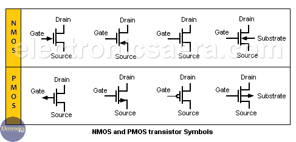
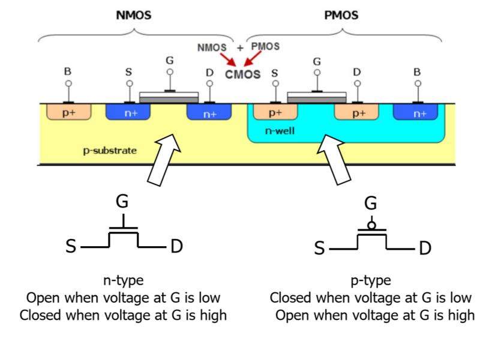

# Transistor Reference

<table>
<tr>
    <td valign='top' style='width:50%;'>
        
    </td>
    <td valign='top' style='width:50%;'>
        
        <b>Open</b>: off, disconnected, no electrical contact. 
        <b>Closed</b>: on, connected, has electrical contact.  
        <table>
        <tr>
            <td>
                <table>
                <tr>
                    <td>Type:</td><td>NMOS, MOSFET channel N</td>
                </tr>
                <tr>
                    <td>Gate:</td><td>P-substrate</td>
                </tr>
                <tr>
                    <td>Source:</td><td>N-substrate</td>
                </tr>
                <tr>
                    <td>Drain:</td><td>N-substrate</td>
                </tr>
                </table>
            </td>
            <td>
                <table>
                <tr>
                    <td>Type:</td><td>PMOS, MOSFET channel P</td>
                </tr>
                <tr>
                    <td>Gate:</td><td>N-substrate</td>
                </tr>
                <tr>
                    <td>Source:</td><td>P-substrate</td>
                </tr>
                <tr>
                    <td>Drain:</td><td>P-substrate</td>
                </tr>
                </table>
            </td>
        </tr>
        </table>
    </td>
</tr>
</table>

